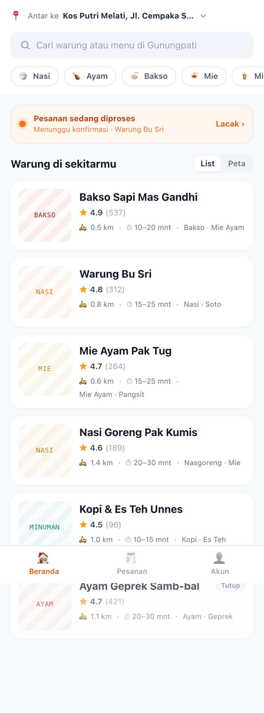
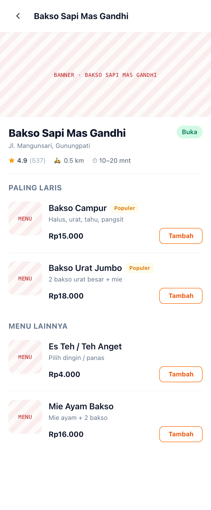
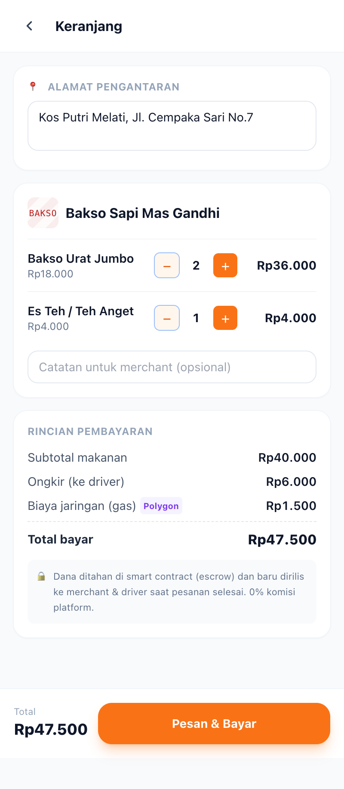
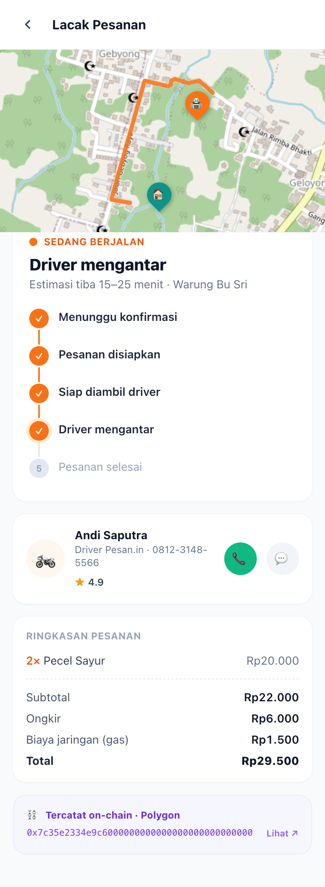
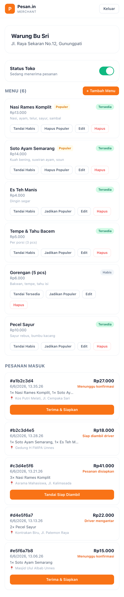
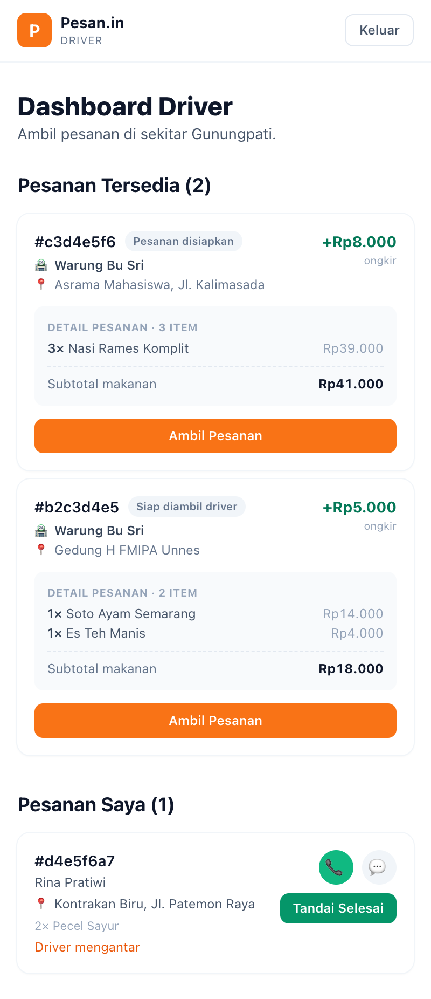
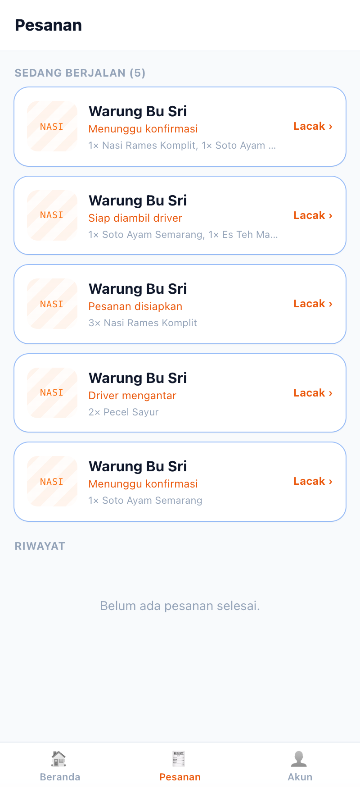
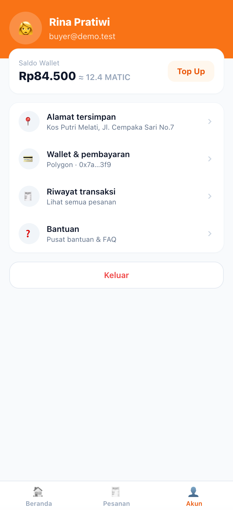

<div align="center">

# 🍔 Pesan.in

### Delivery makanan **0% komisi**, transparan di blockchain — khusus Gunungpati, Semarang.

Harga ke merchant, ongkir ke driver — **langsung, tanpa potongan platform**. Setiap transaksi dicatat on-chain di Polygon.

<br/>


</div>

---

## ✨ Kenapa Pesan.in?

Aplikasi food-delivery konvensional memotong 20–30% dari setiap transaksi. **Pesan.in menghapus potongan itu.** Pembeli bayar sekali (makanan + ongkir + biaya jaringan), dana ditahan di *smart contract escrow*, lalu dirilis otomatis ke merchant & driver saat pesanan selesai.

> 🎯 **MVP fokus area Gunungpati, Semarang** — ekosistem tiga peran dalam satu aplikasi.

| 🛒 Pembeli | 🍔 Merchant | 🏍️ Driver |
|:---|:---|:---|
| Browse warung sekitar, checkout sekali bayar, lacak pesanan real-time | Kelola menu & pesanan masuk, terima pembayaran langsung ke wallet | Ambil pesanan tersedia, antar, ongkir masuk wallet otomatis |

---

## 🚀 Mulai Cepat

```bash
# 1. Install dependency
npm install

# 2. Jalankan dev server
npm run dev
```

Buka **http://localhost:3000** — database lokal `app.db` dibuat & di-seed otomatis saat pertama dijalankan. Tidak perlu setup eksternal apa pun. ✅

### 🔑 Akun Demo

Semua akun memakai password **`demo123`**:

| Peran | Email | Masuk ke |
|:---|:---|:---|
| 🛒 Pembeli | `buyer@demo.test` | `/buyer` |
| 🍔 Merchant | `merchant@demo.test` | `/merchant` |
| 🏍️ Driver | `driver@demo.test` | `/driver` |

> 💡 Di halaman login ada tombol pintas untuk mengisi kredensial otomatis.

---

## 🧭 Alur Pesanan

```
  PEMBELI                 MERCHANT              DRIVER             ESCROW (Polygon)
  ───────                 ────────              ──────             ────────────────
  Checkout & bayar  ──▶   Terima pesanan                          Dana ditahan 🔒
       │                       │
       │                  Tandai siap  ──────▶  Ambil pesanan
       │                                            │
  Lacak real-time  ◀───────────────────────────  Antar
       │                                            │
       ▼                                       Tandai selesai ──▶  Dana dirilis ✅
   Pesanan selesai                                                 merchant + driver
```

Status pesanan: `paid` → `accepted_merchant` → `ready_for_pickup` → `picked_up` → `delivered`.
Halaman tracking pembeli mem-*polling* status sehingga update lintas peran tampil otomatis.

---

## 🖥️ Fitur

<table>
<tr>
<td width="33%" valign="top">

### 🛒 Pembeli
- Beranda dengan **pencarian** & **filter kategori**
- Toggle tampilan **list ↔ peta** (Leaflet)
- Kartu warung: rating, jarak, ETA, tag
- Detail resto + menu populer
- Keranjang persisten (localStorage)
- Checkout: rincian escrow + biaya gas
- **Tracking**: peta rute, timeline, receipt on-chain
- 📞 **Telepon & 💬 chat driver** in-app
- 🔔 **Notifikasi** tiap status pesanan berubah
- Riwayat pesanan & halaman akun + wallet

</td>
<td width="33%" valign="top">

### 🍔 Merchant
- 🏪 **3 halaman + bottom-tab** — Pesanan · Menu · Toko
- Filter pesanan: *Baru · Diproses · Siap · Selesai · Ditolak*
- Aksi: **Terima** / **Tolak** → *Siap Diambil*
- 🧑‍🍳 **Kelola menu mandiri** — tambah, edit, hapus
- Tandai menu *habis* / *populer*
- 🔀 **Toggle buka/tutup toko** + statistik harian
- Pembayaran langsung ke wallet

</td>
<td width="33%" valign="top">

### 🏍️ Driver
- Feed **pesanan tersedia** sekitar
- Ambil pesanan satu klik
- 📞 Telepon & 💬 chat pembeli in-app
- Selesaikan → *settle* on-chain (mock tx)
- Ongkir masuk wallet otomatis

</td>
</tr>
</table>

---

## 🖼️ Tampilan Aplikasi

Tangkapan layar asli dari aplikasi yang berjalan (akun demo, area Gunungpati).

<table>
<tr>
<td align="center" width="33%">
<br/>
<b>🛒 Beranda Pembeli</b><br/>
<sub>Search, kategori, kartu warung, banner pesanan aktif, cart FAB</sub>
</td>
<td align="center" width="33%">
<br/>
<b>🍽️ Detail Warung</b><br/>
<sub>Menu populer, deskripsi, stepper jumlah, bar keranjang</sub>
</td>
<td align="center" width="33%">
<br/>
<b>🧾 Checkout & Escrow</b><br/>
<sub>Alamat, rincian biaya, gas Polygon, catatan 0% komisi</sub>
</td>
</tr>
<tr>
<td align="center" width="33%">
<br/>
<b>📍 Lacak Pesanan</b><br/>
<sub>Rute jalan asli (OSRM), timeline status, kartu driver, receipt on-chain</sub>
</td>
<td align="center" width="33%">
<br/>
<b>🍔 Dashboard Merchant</b><br/>
<sub>Toggle toko, kelola menu (tambah/edit/hapus), pesanan masuk + aksi</sub>
</td>
<td align="center" width="33%">
<br/>
<b>🏍️ Feed Driver</b><br/>
<sub>Detail item pesanan, ambil pesanan, telepon/chat pembeli</sub>
</td>
</tr>
</table>

<details>
<summary>Layar lain — Riwayat & Akun</summary>

<table>
<tr>
<td align="center" width="50%">
<br/>
<b>🧾 Pesanan</b> <sub>— semua pesanan berjalan + riwayat</sub>
</td>
<td align="center" width="50%">
<br/>
<b>👤 Akun</b> <sub>— wallet, alamat, pengaturan</sub>
</td>
</tr>
</table>

</details>

---

## 🏗️ Arsitektur & Teknologi

**Stack:** Next.js 14 (App Router) · React 18 · Tailwind CSS · better-sqlite3 · Leaflet · bcryptjs · Polygon (escrow)

```
app/
├─ (shop)/                 # Route group pembeli (dibungkus CartProvider)
│  ├─ buyer/               #   Beranda
│  ├─ resto/[id]/          #   Detail warung
│  ├─ cart/                #   Keranjang & checkout
│  ├─ orders/              #   Riwayat
│  ├─ orders/[id]/         #   Tracking pesanan
│  └─ account/             #   Akun & wallet
├─ merchant/ · driver/     # Dashboard mitra
├─ login/ · register/      # Auth
└─ api/
   ├─ auth/                # login · register · logout (cookie session)
   ├─ merchant/            # kelola menu + buka/tutup toko
   └─ orders/              # buat order, aksi status, & chat per pesanan

components/                # ui · buyer · merchant · driver · chat · maps · layout
lib/
├─ db/                     # schema + seed, query, users (SQLite lokal)
├─ auth/                   # session & konstanta (edge-safe)
├─ notify.js               # notifikasi status (service worker + Web Notifications)
└─ format.js               # util format Rupiah, label status, biaya
public/sw.js               # service worker notifikasi
```

**Catatan desain:**
- 🗄️ **Data lokal** — semua persistensi lewat `better-sqlite3` (`app.db`), di-seed dari data Gunungpati. Tanpa layanan eksternal.
- 🔒 **Harga divalidasi server** — endpoint order tidak mempercayai harga dari client; selalu cek ulang ke DB.
- ⚡ **Edge-safe middleware** — konstanta auth dipisah agar middleware tak menarik modul native.
- 💰 **0% komisi** — total bayar = subtotal + ongkir + biaya jaringan; tidak ada potongan platform.

---

## 📜 Skrip

| Perintah | Fungsi |
|:---|:---|
| `npm run dev` | Jalankan dev server (hot reload) |
| `npm run build` | Build produksi |
| `npm run start` | Jalankan hasil build |
| `npm run lint` | Lint kode |

---

## 🗺️ Roadmap

- [x] 📞💬 Telepon & chat driver in-app
- [x] 🔔 Notifikasi status pesanan
- [x] 🧑‍🍳 Manajemen menu mandiri untuk merchant
- [x] 🏪 **Redesign merchant gaya GoBiz** — 3 halaman terpisah (Pesanan · Menu · Toko) dengan bottom-tab, filter status pesanan, tombol terima/tolak, & statistik toko (pesanan & pendapatan harian). Referensi: `pesanin-mockup/pesanin/merchant.jsx`
- [ ] Integrasi smart contract escrow Polygon sungguhan (kini mock tx hash)
- [ ] Wallet & Top Up nyata (saldo MATIC)
- [ ] Web Push sungguhan (VAPID + server push, kini notifikasi via polling client)
- [ ] Perluasan area di luar Gunungpati

---

<div align="center">

**Pesan.in** — MVP food delivery 0% komisi · Gunungpati, Semarang 🧡

<sub>Dibangun dengan Next.js + SQLite lokal. Referensi UI: <code>pesanin-mockup/</code></sub>

</div>
